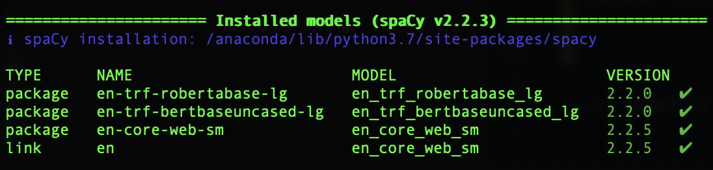

# Multimodal Graph Networks (MGN) 
Associated supporting code for the [Multimodal Graph Networks] paper(https://arxiv.org/).

## Table of Contents
   * [Introduction](#introduction)
   * [Setup](#setup)
       * [Prerequisites](#setup-prerequisites)
   * [Demo](#demo)
   * [References](#references)

## Introduction <a name="introduction"></a>
This code repo acts as the supplementary code and dataset repo for the MGN paper. For CLEVR dataset generation please refer to the original CLEVR [repo](https://github.com/facebookresearch/clevr-dataset-gen).
For CLOSURE templates, please refer to the [repo](https://github.com/rizar/CLOSURE) and [paper](https://arxiv.org/abs/1912.05783).
  

## Setup <a name="setup"></a>
1. Clone this repo and the submodules.
2. Create a conda environment (or virtualenv) (Python 3.7+) for this project:
```angular2
$ conda create --name mgn
```
Then use the requirements.txt to install the required packages
```angular2
$ pip install -r requirements.txt
```

### Prerequisites <a name="setup-prequisites"></a>
The CLEVR Parser library uses _spacy_ framework as the NLP backend to use.

-*- Spacy -*-

The default backend uses `spacy` for language parsing and pretrained LM models used for embeddings.

Please see spacy's doc for installation [instructions](https://spacy.io/usage).

Spacy language models (LM) can be downloaded following instructions [here](https://spacy.io/usage/models).
N.b. the `spacy-transformers` package ([homepage](https://spacy.io/universe/project/spacy-transformers), [github](https://github.com/explosion/spacy-transformers)),
can be used to download SotA transformer based (BERT, XLNet, RoBerTa) LMs - including the popular HuggingFace implementations.

The very basic installation entails:
```angular2
$ pip install spacy
$ python -m spacy download en_core_web_sm 
```

Once installed, validate the available LMs using: 
`python -m spacy info` and `python -m spacy validate`.

 


## Demo  <a name="demo"></a>

## References <a name="references"></a>