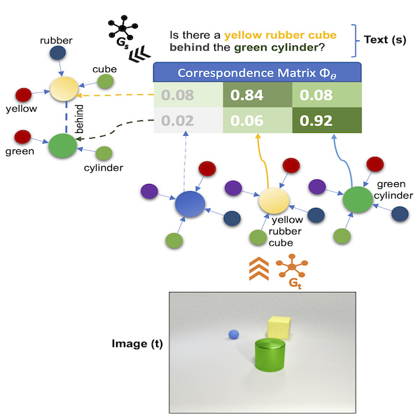

# Multimodal Graph Networks (MGN) 
Associated supporting code for the [Multimodal Graph Networks] paper(https://arxiv.org/).

## Table of Contents
   * [Introduction](#introduction)
   * [Setup](#setup)
       * [Prerequisites](#setup-prerequisites)
   * [Demo](#demo)
   * [References](#references)

## Introduction <a name="introduction"></a>
This code repo acts as the supplementary code and dataset repo for the MGN paper. For CLEVR dataset generation please refer to the original CLEVR [repo](https://github.com/facebookresearch/clevr-dataset-gen).
For CLOSURE templates, please refer to the [repo](https://github.com/rizar/CLOSURE) and [paper](https://arxiv.org/abs/1912.05783).
  

## Setup <a name="setup"></a>
1. Clone this repo and the submodules.
2. Create a conda environment (or virtualenv) (Python 3.7+) for this project:
```angular2
$ conda create --name mgn
```
Then use the requirements.txt to install the required packages
```angular2
$ pip install -r requirements.txt
```

### Prerequisites <a name="setup-prequisites"></a>
The CLEVR Parser library uses _spacy_ framework as the NLP backend to use.

-*- Spacy -*-

The default backend uses `spacy` for language parsing and pretrained LM models used for embeddings.

Please see spacy's doc for installation [instructions](https://spacy.io/usage).

Spacy language models (LM) can be downloaded following instructions [here](https://spacy.io/usage/models).
N.b. the `spacy-transformers` package ([homepage](https://spacy.io/universe/project/spacy-transformers), [github](https://github.com/explosion/spacy-transformers)),
can be used to download SotA transformer based (BERT, XLNet, RoBerTa) LMs - including the popular HuggingFace implementations.

The very basic installation entails:
```angular2
$ pip install spacy
$ python -m spacy download en_core_web_sm 
```

Once installed, validate the available LMs using: 
`python -m spacy info` and `python -m spacy validate`.

 

## Dataset Generation
Please follow instructions from the CLEVR Dataset Generation repo [here](git@github.com:facebookresearch/clevr-dataset-gen.git)
You can clone a local copy under `./vendors` within the project using:

`git submodule update --init --recursive`

For replicating the experiments with captions, we can essentially use the same scripts in the aforementioned repo, but 
simply use '__caption generation__' templates. These templates are included in the `data/templates` directory.

A demo data directory for illustration can be obtained by running:
```angular2html
. data/download-demo-data.sh
```
The subsequent structure of the data folder should look like:


The CLOSURE templates (post downloading) are under `data/CLOSURE_v1.0`. Addtional templates 
are under `data/templates`

## Running Experiments

- Preprocess the questions/captions to generate the .h5 file (e.g. _clevr_train_questions_25k.h5_)
- __Train__: Pretrain on 25K questions, then use the pre-trained model for fine-tuning (using REINFORCE)
     - Pretrain:
     ```angular2html
     $ python ${ROOT}/mgn/tools/run_train.py \
                     --checkpoint_every 50   \
                     --num_iters 100 \
                     --run_dir ../data/outputs/model_pretrain_clevr_25kpg \
                     --clevr_train_question_path ../data/${PATH_TO_PREPROCESSED_QUESTIONS}/clevr_train_questions_25000/clevr_train_questions_25k.h5 \
                     --gembd_vec_dim 96
     ```
       
     - Fine-Tune:
     ```angular2html
     $ python ${ROOT}/mgn/tools/run_train.py \
                     --reinforce 1 \
                     --learning_rate 1e-5 \
                     --checkpoint_every 50   \
                     --num_iters 100 \
                     --run_dir ../data/outputs/model_reinforce_clevr_25kpg \
                     --load_checkpoint_path ../data/outputs/model_pretrain_clevr_25kpg/checkpoint_best.pt \
                     --clevr_train_question_path ../data/${PATH_TO_PREPROCESSED_QUESTIONS}/clevr_train_questions_25000/clevr_train_questions_25k.h5 \
                     --gembd_vec_dim 96 
     
     ```

- __Test__: 
     ```angular2html
     $ python ${ROOT}/mgn/tools/run_test.py \                     
                     --run_dir ../data/results \
                     --clevr_val_scene_path ../data/{PATH_TO_SCENES}/clevr_val_scenes_parsed.json \
                     --clevr_val_question_path ../data/{PATH_TO_PREPROCESSED_QUESTIONS}/clevr_val_questions.h5 \
                     --clevr_vocab_path ../data/{PATH_TO_VOCAB}/clevr_vocab.json \
                     --load_checkpoint_path ../data/outputs/model_reinforce_clevr_25kpg/checkpoint_best.pt
                     --max_val_samples 1024 \
                     --is_baseline_model 0
     ```

[comment]: <> (## Demo  <a name="demo"></a>)

[comment]: <> (## References <a name="references"></a>)